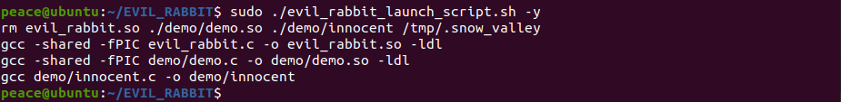

# EVIL RABBIT
Evil Rabbit metaphorically is a member of snow valley hidden in the himalayan range. It resides in each and every member of the valley monitoring all the good/evil yet noone is able to find it.  
Following the analogy, evil rabbit is a **LD_PRELOAD** based **userland rootkit** developed as a mere POC for the demonstration and explanation of **SO injection** capabilities (analogous to *DLL injection* on Windows). Currently it does the following - 
* Conceal itself and in general any file specified on the filesystem (including GNOME file manager - nautilus)
* Posses a payload of **TCP bind shell** which is activated only if a /tmp directory contains a file named *.snow_valley* (i.e. /tmp/.snow_valley).
 

If you wish to build an understanding towards userland rootkits or the project itself, I've written an article for the same.  [Memory Malware Part 0x2 — Crafting LD_PRELOAD Rootkits in Userland]  

**NOTE**: Try *not* to run it on a system close to your heart. Keep it unmodified and it probably won't put your system to an unstable state, still it is strongly suggested to run it in a virtual machine (since it not tested on all variants of Linux).

## Usage !
To check it out, follow the below steps on your Linux machine. 

* Clone the repository - `git clone https://github.com/compilepeace/EVIL_RABBIT`

* Building it includes running a make command and giving executable permissions to  **evil_rabbit.so** and **evil_rabbit_launch_script.sh**. 

* Just before infection, have a look at your IP address and listening connections on your system. Notice that initially nautilus (GNOME file manager) shows all the files we built.

* Run it by executing the launch script!

* Notice that the files whose names start with "evil_rabbit" are not printed out to STDOUT and the system starts listening on the port 19999 as soon as we enter the command 'ls' after infection. Using netcat, I connected from my host OS at **192.168.58.1** to the infected VM (Ubuntu 20.04) running at IP address **192.168.58.205** that provides a **TCP bind shell** to anyone who connects.

**DISCLAIMER** — It was build to only be used for educational purposes. Don’t risk yourself by using it for malicious purposes, it might attract hell. Try to keep the world a safe place ×_×

**Do you believe in magic ?** 
Cheers x_x
 

**NAME**  : Abhinav Thakur  
**EMAIL** : compilepeace@gmail.com  

[Memory Malware Part 0x2 — Crafting LD_PRELOAD Rootkits in Userland]: https://medium.com/@compilepeace/memory-malware-part-0x2-writing-userland-rootkits-via-ld-preload-30121c8343d5
